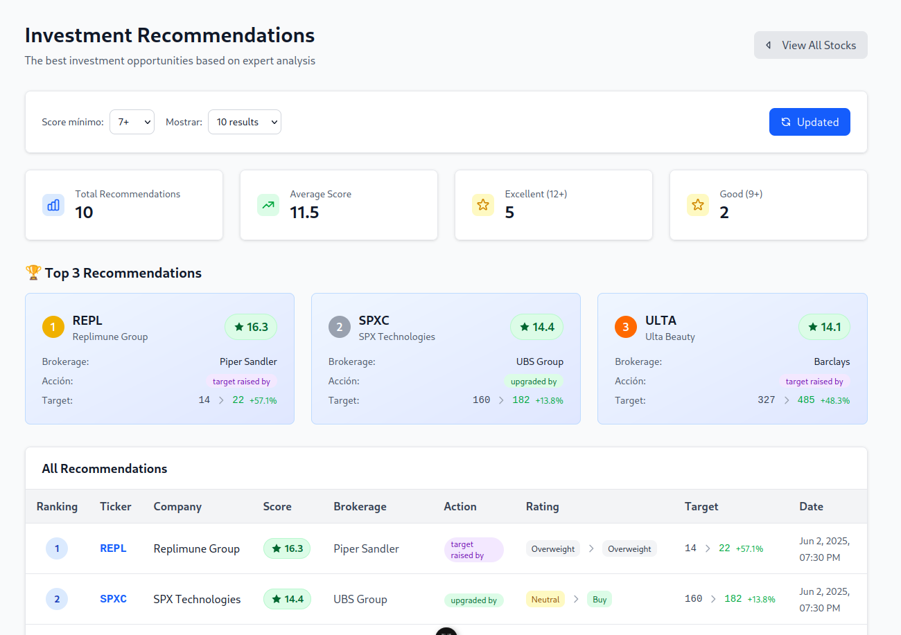
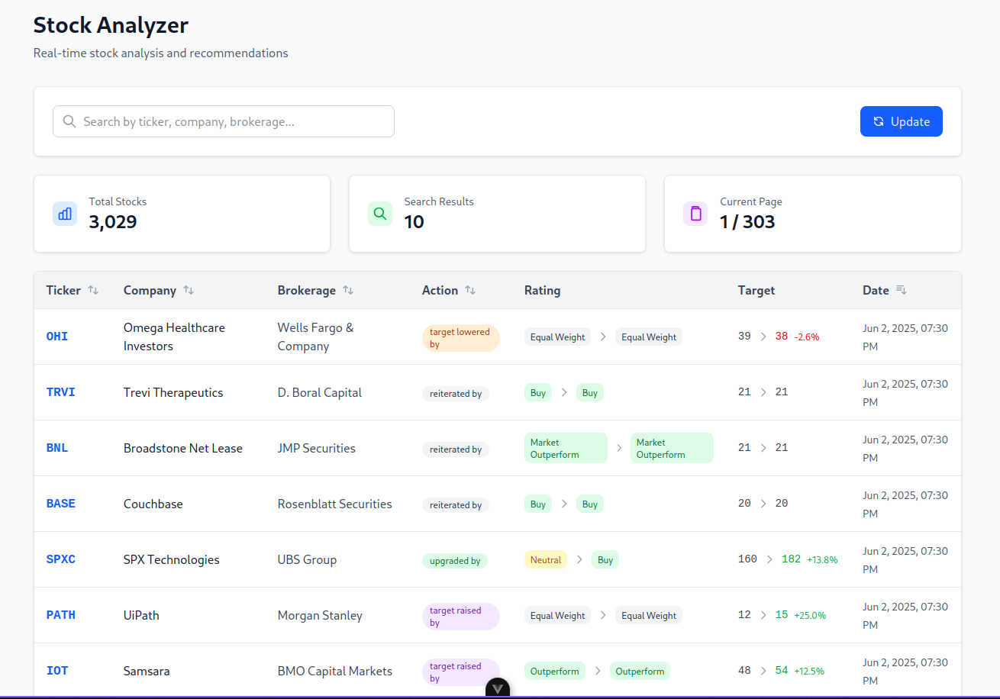

# 📈 Stock Recommender App

Una aplicación simple construida con Go, Vue y CockroachDB que permite obtener, almacenar y visualizar recomendaciones de acciones de bolsa. Implementa un sistema de recomendación basado en reglas para sugerir las mejores acciones en las que invertir hoy.

<div style="display: flex; gap: 16px; flex-wrap: wrap;">
    
    
</div>

---

## 🚀 Características

- ETL automático desde una API externa con paginación.
- Backend en Go con endpoints RESTful.
- Base de datos relacional (CockroachDB).
- Frontend en Vue.js para búsqueda, filtrado y visualización.
- Algoritmo de recomendación de acciones basado en potencial de ganancia, acción del bróker, cambio de rating y actualidad.

---

## 🛠️ Tecnologías

- **Backend:** Go + Chi + CockroachDB
- **Frontend:** Vue.js + Pinia + Tailwind CSS
- **Base de datos:** CockroachDB

---

## 🧪 Requisitos

- Go ≥ 1.19
- Docker (para correr CockroachDB localmente)
- curl o Postman para probar la API
- Node.js ≥ 16 (para el frontend, si aplica)

---

## Requerimientos: Como fueron resultos y sus retos

---

### ⚙️ Parte 1: Implementación del Proceso ETL (_Connect to the API and store the data_)

Para resolver el requerimiento de descargar la información de stocks del api externa proporcionada que implica un proceso de **_Extraer, Transformar y Cargar (ETL)_** datos desde una API externa hacia una base de datos en la nube (CockroachDB), se desarrolló un proceso automático en Go que ejecuta los siguientes pasos:

#### **_✅ Extracción_**

Se consume una API que retorna información de acciones de manera paginada. Para cada página, se realiza una solicitud `GET` autenticada. El resultado se deserializa en estructuras tipo `APIRawItem`.

- **_Reto_**: La API no siempre responde con datos consistentes. En ocasiones, ciertos campos vienen vacíos o mal formateados. Para solucionarlo, se agregaron validaciones robustas antes de transformar los datos.

#### **_🔄 Transformación_**

Cada item recibido se transforma en un objeto Stock, validando campos obligatorios (ticker, time) y convirtiendo strings numéricos con símbolos como `$` y , a `float64`. También se descartan registros con valores inválidos en campos como `rating_from` o `rating_to`, que podrían sesgar análisis posteriores.

- **_Reto_**: Algunos registros venían con ratings vacíos o inconsistentes. Decidí ignorarlos durante la transformación y registrar estos fallos en una tabla aparte (failed_items), para poder analizarlos sin afectar la calidad del dataset principal.

#### **_💾 Carga_**

Una vez transformado el dato, se inserta en la tabla stocks. Se utiliza la estrategia ON CONFLICT DO NOTHING para evitar duplicados basados en la clave (`ticker`, `time`).

- **_Reto_**: A pesar de las validaciones, podrían presentarse errores al insertar (por ejemplo, por campos nulos no controlados). En ese caso, también se guarda el item fallido junto con el mensaje de error en la tabla `failed_items`.

#### **_🧾 Registro de errores_**

Para asegurar la trazabilidad, todo el proceso genera logs en archivos con timestamps, ubicados en una carpeta `logs/`. Además, se implementó una tabla en la base de datos para guardar los registros que fallaron en las fases de transformación o carga, con sus respectivos mensajes de error y la fase en la que ocurrió el problema.

---

### 🛠️ Parte 2.1: API RESTful

Una vez los datos fueron almacenados correctamente en la base de datos, el siguiente paso fue crear una **API RESTful** para exponer esta información a través de endpoints organizados, seguros y bien estructurados.

#### **_🔌 Endpoints Implementados_**

Se definieron 3 endpoints que permiten consultar información de acciones almacenadas:

##### 🔍 `GET /stocks`

```shell
curl "http://localhost:8080/stocks?search=pharma&sort_by=target_to&order=desc&page=1&limit=10"
```

response:

```json
{
  "items": [
    {
      "ticker": "REGN",
      "company": "Regeneron Pharmaceuticals",
      "brokerage": "BMO Capital Markets",
      "action": "target lowered by",
      "rating_from": "Outperform",
      "rating_to": "Outperform",
      "target_from": 800,
      "target_to": 600,
      "time": "2025-06-03T00:30:05.843101Z"
    }
    // etc...
  ],
  "limit": 10,
  "page": 1,
  "total": 83,
  "totalPages": 9
}
```

##### ⭐ `GET /stocks/recommendations`

Devuelve las mejores acciónes para invertir hoy según el algoritmo.

```shell
curl http://localhost:8080/stocks/recommendations
```

response

```json
[
  {
    "ticker": "SPXC",
    "company": "SPX Technologies",
    "brokerage": "UBS Group",
    "action": "upgraded by",
    "rating_from": "Neutral",
    "rating_to": "Buy",
    "target_from": 160,
    "target_to": 182,
    "time": "2025-06-03T00:30:06.138894Z",
    "Score": 14.4375
  },
  {
    "ticker": "PATH",
    "company": "UiPath",
    "brokerage": "Morgan Stanley",
    "action": "target raised by",
    "rating_from": "Equal Weight",
    "rating_to": "Equal Weight",
    "target_from": 12,
    "target_to": 15,
    "time": "2025-06-03T00:30:06.134828Z",
    "Score": 8.25
  }
  // etc...
]
```

##### 📌 `GET /stocks/:ticker`

Devuelve detalles de una acción específica.

```shell
curl "http://localhost:8080/stocks/AKBA"
```

response:

```json
{
  "ticker": "AKBA",
  "company": "Akebia Therapeutics",
  "brokerage": "Leerink Partners",
  "action": "initiated by",
  "rating_from": "Outperform",
  "rating_to": "Outperform",
  "target_from": 7,
  "target_to": 7,
  "time": "2025-04-29T00:30:06.253903Z"
}
```

#### 🧱 Organización: Handler, Service y Repository

Se siguió una arquitectura de 3 capas:

```
handler.go  ⟶  service.go  ⟶  repository_interface.go  ⟶  repository_cockroachdb.go
```

- handler.go: expone los endpoints HTTP y maneja parámetros de la petición.
- service.go: contiene la lógica de negocio (ej. cálculo del puntaje).
- repository_interface.go: define las operaciones esperadas sobre los datos.
- repository_cockroachdb.go: implementación de las operaciones usando SQL con pgx.

🧩 Ventaja: esta separación facilita testeo, mantenimiento y futura migración de la capa de datos.

---

### 🛠️ Parte 2.2: Frotend

El frontend fue desarrollado en Vue 3 con TypeScript, siguiendo buenas prácticas como el uso de la API de composición, componentes modulares y separación clara entre vistas, componentes y lógica de estado.

Se utilizó Pinia para el manejo del estado global, especialmente para:

- Cachear peticiones a la API (evitando llamadas innecesarias).
- Almacenar filtros de búsqueda como el score mínimo y el límite de resultados.
- Gestionar tablas y estadísticas derivadas (top 3 recomendaciones, promedio, distribución, etc.).

Gracias a Pinia y la reactividad de Vue, el sistema actualiza automáticamente los datos al modificar los filtros, mejorando la experiencia del usuario.

- Además, se aplicaron buenas prácticas como:
- Organización por carpetas (components, stores, models, views).
- Componentes reutilizables y tipados.
- Uso de Tailwind CSS para un diseño responsivo y limpio.
- Integración eficiente con el backend mediante variables de entorno y peticiones dinámicas.

<!--
- posibles mejoras si la app escala
TODO: expliación de como funciona el algoritmo y posibles mejores
- Arquitectura de eventos, como se podría escalar este sistema para trabajar con datos "vivos" cron-jobs, lambdas, microservicios, colas


TODO: despliegue con terraform
TODO: tests e2e y algunos tests


TODO: explicar como se maneja todo el SDLC (testing, ci, deploy etc...), herramietnas de desarrollo: linters, format, testing, git-hooks, pipelines
---

TODO: Get started variable de entorno etc.
 -->

<!--
TODO: incluir imagenes de la app funcionando
TODO: script o docker-compose para levantar toda el app por primera vez

-->
